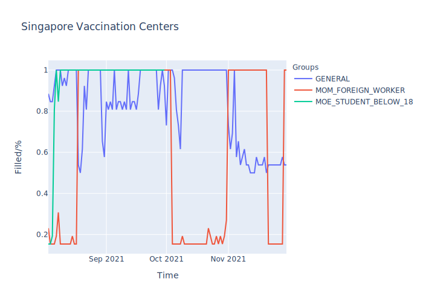
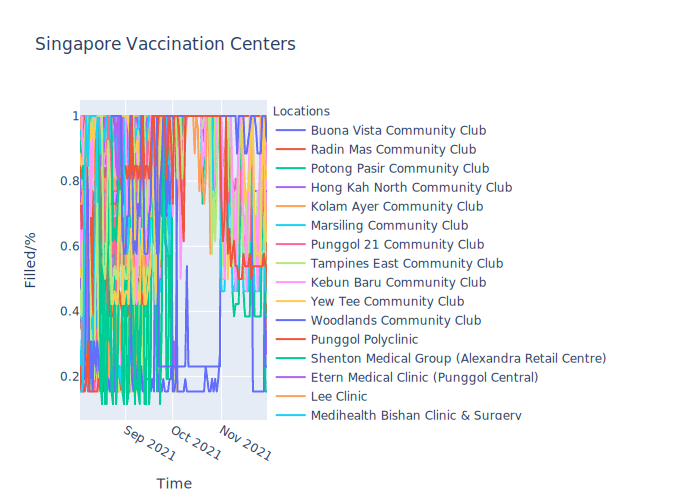
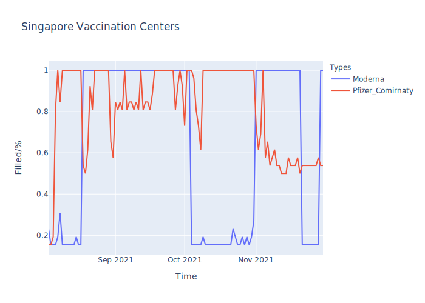

# Singapore Vaccine Registration Programme

Singapore's vaccine registration is powered off vaccine.gov.sg

The system has an internal API that checks for date availability.

This script uses the API and through a command like interface allows users to check for slot availability.

just a proof-of-concept :D

## Graphs

Click on images or go [here](https://fourjr.github.io/sg-vaccines/) for interactive versions.

